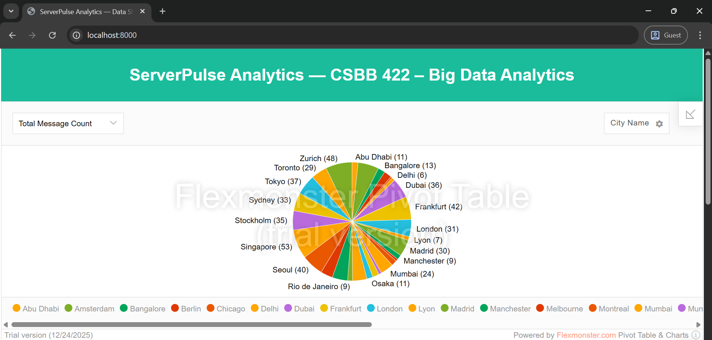
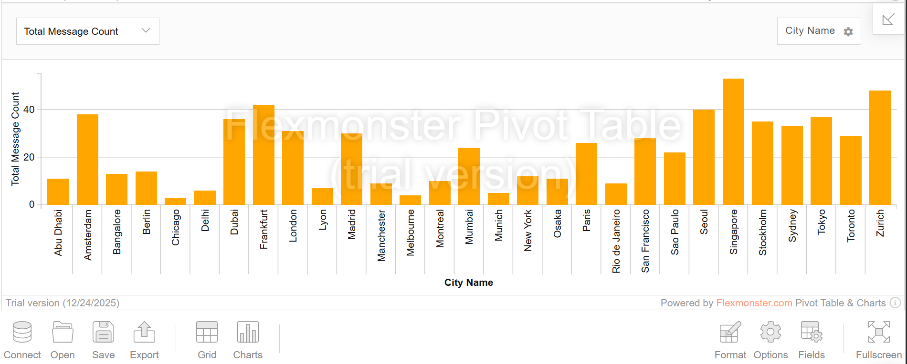
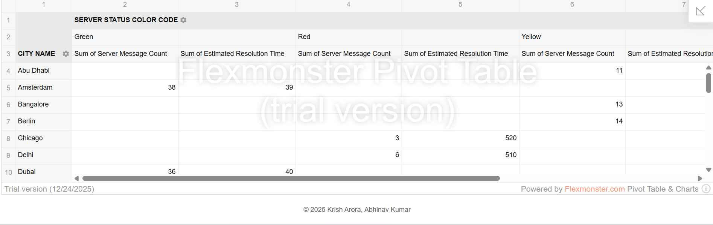

# ServerPulse Analytics

**Project**: ServerPulse Analytics - Data Stream Analysis Platform  
**Course**: CSBB 422 – Big Data Analytics Project  
**Semester**: 7th Semester, B.Tech CSE  
**Krish Arora** - Roll No: 221210060  
**Abhinav Kumar** - Roll No: 221210004

---

**Real-time data stream analysis platform for monitoring data center server health and performance**


---

## 📋 Table of Contents
- [About](#about)
- [Architecture](#architecture)
- [Features](#features)
- [Tech Stack](#tech-stack)
- [Quick Start](#quick-start)
- [Detailed Setup](#detailed-setup)
- [Screenshots](#screenshots)
- [Configuration](#configuration)
- [Troubleshooting](#troubleshooting)
- [Authors](#authors)

---

## 🎯 About

**ServerPulse Analytics** is an enterprise-grade real-time data stream analysis platform designed to monitor and analyze data center server health. The system provides:

- **Real-time Event Ingestion** - Captures server status events using Apache Kafka message streaming
- **Stream Processing Engine** - Processes and aggregates data using Apache Spark (PySpark)
- **Live Analytics Dashboard** - Visualizes server health metrics through Django and Flexmonster
- **Proactive Monitoring** - Enables rapid identification of server issues and tracks resolution times
- **Scalable Architecture** - Built on containerized microservices for horizontal scaling

This platform demonstrates production-ready big data streaming architectures for real-time operational intelligence.

---

## 🏗️ Architecture


### Data Pipeline Flow

```
Server Events → Python Simulator → Kafka → Spark Streaming → PostgreSQL → Django Dashboard
```

**Key Components:**
1. **Event Simulator** - Generates real-time server status events
2. **Apache Kafka** - Message broker for event streaming
3. **Apache Spark** - Stream processing and data aggregation
4. **PostgreSQL** - Stores processed event data
5. **Django Dashboard** - Real-time visualization with Flexmonster

---

## ✨ Features

- Real-time server status monitoring
- Event aggregation by country, city, and severity level
- Estimated issue resolution time tracking
- Interactive dashboard with live updates
- Scalable architecture using Docker containers
- Data persistence in PostgreSQL
- One-command deployment

---

## 🛠️ Tech Stack

- **Stream Processing**: Apache Spark 3.0+, PySpark
- **Message Broker**: Apache Kafka
- **Database**: PostgreSQL 15
- **Backend**: Django 3.1
- **Visualization**: Flexmonster
- **Containerization**: Docker, Docker Compose
- **Language**: Python 3.8+

---

## 🚀 Quick Start

### Prerequisites
- Docker Desktop installed and running
- Python 3.8+ with pip
- Apache Spark 3.0+ (optional, for local Spark job)

### Step 1: Start Services

**Windows (PowerShell):**
```powershell
.\run_demo.ps1
```

**Linux/macOS:**
```bash
chmod +x run_demo.sh
./run_demo.sh
```

Wait 30 seconds for all services to initialize.

### Step 2: Run Event Simulator

Open a new terminal:
```bash
pip install kafka-python requests
python data_center_server_live_status/data_center_server_live_status_simulator.py
```

### Step 3: Run Spark Streaming Job

Open another terminal:
```bash
spark-submit --packages org.apache.spark:spark-sql-kafka-0-10_2.12:3.0.1,org.postgresql:postgresql:42.2.16 datapipeline/real_time_streaming_data_pipeline.py
```

Or use the script:
```powershell
.\run_spark.ps1
```

### Step 4: View Dashboard

Open http://localhost:8000 in your browser to see real-time analytics.

---

## 📖 Detailed Setup

For detailed installation instructions and troubleshooting, see [SETUP.md](SETUP.md).

### Docker Services

The project uses Docker Compose to orchestrate:
- **ZooKeeper** (port 2181) - Kafka coordination
- **Kafka** (port 9092) - Message broker
- **PostgreSQL** (port 5432) - Database
- **Django Dashboard** (port 8000) - Web interface

### Monitoring Commands

**Check running containers:**
```bash
docker ps
```

**View Kafka topics:**
```bash
docker exec kafka kafka-topics --list --bootstrap-server localhost:9092
```

**Query database:**
```bash
docker exec -it postgres psql -U demouser -d event_message_db -c "SELECT * FROM event_message_detail_agg_tbl LIMIT 10;"
```

**Stop all services:**
```bash
docker-compose down
```

---

## 📸 Screenshots

### ServerPulse Analytics Dashboard - Overview

*Main dashboard showing real-time server status analytics with interactive charts and data tables*

### Dashboard - City-wise Server Analytics

*Detailed breakdown of server events by city with status color indicators and resolution times*

### Dashboard - Event Distribution Analysis

*Comprehensive view of server message counts and estimated resolution times across different locations*

### System Architecture

*System architecture and use case diagram showing data flow*

### Kafka Configuration

*Kafka broker configuration and topic setup*

---

## 🔧 Configuration

### Database
- **Database**: `event_message_db`
- **User**: `demouser`
- **Password**: `demouser`
- **Port**: `5432`
- **Table**: `dashboard_event_message_detail_agg_tbl` (created by Django migrations)

### Kafka
- **Topic**: `server-live-status`
- **Bootstrap Server**: `localhost:9092`

### Spark
- **Master**: `local[*]`
- **Trigger Interval**: 20 seconds
- **Packages**: Kafka connector, PostgreSQL JDBC driver

---

## 🐛 Troubleshooting

**Port already in use:**
```bash
netstat -ano | findstr :8000  # Windows
lsof -i :8000                 # Linux/Mac
```

**Kafka not starting:**
- Wait 30 seconds after starting services
- Check logs: `docker logs kafka`

**No data in dashboard:**
- Verify simulator is running
- Check Spark job console output
- Query PostgreSQL: `docker exec -it postgres psql -U demouser -d event_message_db`

For detailed troubleshooting, see [SETUP.md](SETUP.md).

---

## 📚 Project Structure

```
serverpulse-analytics/
├── data_center_server_live_status/    # Event simulator
├── datapipeline/                      # Spark streaming job
├── server_status_monitoring/          # Django dashboard
├── images/                            # Screenshots
├── docker-compose.yml                 # Docker services
├── run_demo.ps1 / run_demo.sh        # Startup scripts
└── run_spark.ps1 / run_spark.sh      # Spark launcher
```

---

## 📄 License

This project is open source and available for educational purposes.

---

## 👥 Authors

**Krish Arora** - Roll No: 221210060  
**Abhinav Kumar** - Roll No: 221210004

**Project**: ServerPulse Analytics - Data Stream Analysis Platform  
**Course**: CSBB 422 – Big Data Analytics Lab Project  
**Semester**: 7th Semester, B.Tech CSE

---

## 🙏 Acknowledgments

- Apache Software Foundation for Kafka, Spark, and Hadoop
- Django Software Foundation
- Flexmonster for visualization components
- Docker for containerization platform

---

<p align="center">
  <strong>ServerPulse Analytics</strong> - Real-Time Data Stream Analysis Platform<br>
</p>
